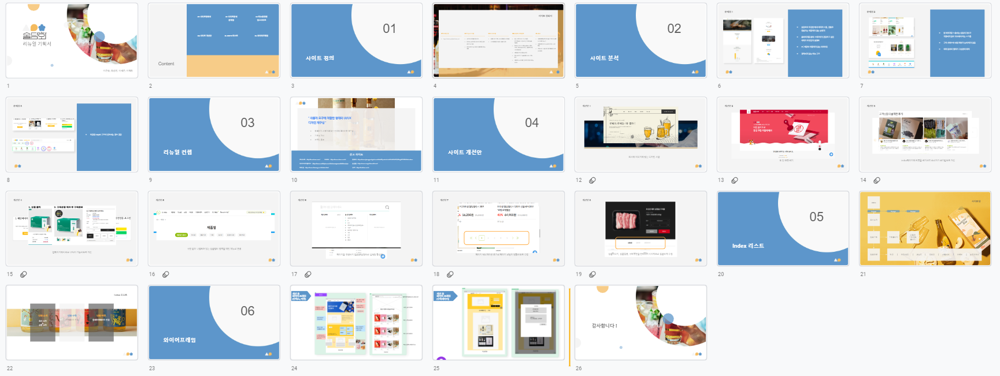

# 술담화 리뉴얼 프로젝트

HTML5, CSS3, JavaScript를 활용한 구독서비스 관련 웹사이트 리뉴얼 프로젝트

## 🙋 프로젝트 소개

HTML5, CSS3, JavaScript의 학습을 목적으로 한 리뉴얼 프로젝트입니다.

'[술담화](https://www.sooldamhwa.com/)' 라는 구독서비스 사이트 리뉴얼을 진행하였습니다.

조원인 '유상범, 이은솔, 이채림'과 함께 리뉴얼 방향, 웹사이트 와이어프레임 구성을 진행하였고,

실질적인 구현(퍼블리싱)은 개인적으로 진행하였습니다.

index 페이지는 술담화를 소개하는 페이지입니다. index 페이지를 통해 구독 페이지로 이동 할 수 있습니다.

구독 페이지는 간단한 기능이 구현되어 있습니다.

---

### ⌛ 개발 기간

2023.01.19일 ~ 2023.02.23일

### ⚙ 개발 환경

`Visual Studio code` 를 통해 개발을 진행했습니다.

팀원들과 협업은 `Figjam` 을 통해 진행하였습니다.

`Adobe Photoshop, Adobe Illustrator` 을 이용해 이미지 편집을 진행하였습니다.

### 📚 사용 언어

---

### 🔗 링크 모음

데모 링크 : <https://jeeun99.github.io/sooldamhwaProject/>

아이디어 회의 링크: [피그잼\_링크](https://www.figma.com/file/YozkvhzSRsCPTOcm3J3be3/%EC%88%A0%EB%8B%B4%ED%99%94-%EB%A6%AC%EB%89%B4%EC%96%BC?node-id=0%3A1&t=t52fKBMXKchiX5u4-0)

Figma 링크: [이제은\_술담화](https://www.figma.com/file/QQoyohTwTnExhMq13soUvo/%EC%9D%B4%EC%A0%9C%EC%9D%80_%EC%88%A0%EB%8B%B4%ED%99%94?node-id=0%3A1)

리뉴얼 기획서: 아래 사진 클릭시 프레젠테이션으로 이동됩니다.

